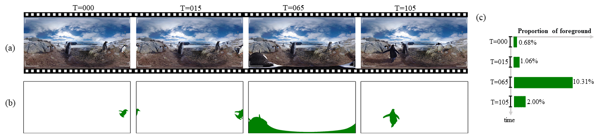

# PanoVOS: Bridging Non-panoramic and Panoramic Views with Transformer for Video Segmentation 

**[🏠[Homepage]](https://shilinyan99.github.io/PanoVOS/)** &emsp; **[📄[Paper]](https://arxiv.org/abs/2309.12303)**


PanoVOS is the first benchmark for panoramic video object segmentation. 



## News

***[🔥🔥🔥28.09.2023: Dataset has been released!]***
***[🚀🚀🚀28.09.2023: CodaLab competition is on live now!]***

## Dataset

***[🔥🔥🔥22.09.2023: Dataset has been released!]***

⬇️ Get the dataset from: 

 - ☁️ [Google Drive](https://drive.google.com/drive/folders/18dki-y3bTdoLcoJgdvKmaiqcqlUfBgyA?usp=drive_link)
 - ☁️ [OneDrive]() ***(Preparing)***
 - ☁️ [Baidu Pan]() ***(Preparing)***


🤗 Or use [gdown](https://github.com/wkentaro/gdown):

 ```bash
 🎉 train.zip 5.88 GB
  gdown 'https://drive.google.com/uc?id=178E1TYK7tgj-FXzgnjJyx9gZs2GhQBqr'
🎆 valid.zip 3.5 GB
  gdown 'https://drive.google.com/uc?id=10P49VBM7vhGHCqhYvaIjzs7wV0oKLGNl'
📌 test.zip 3.21 GB
  gdown 'https://drive.google.com/uc?id=1dOiJ55rDP82Fdvm32OYuh1RGMCdHxCMe'
 ```

### File Structure
The dataset follows a similar structure as [DAVIS](https://davischallenge.org/) and [Youtube-VOS](https://youtube-vos.org/). The dataset consists of two parts: `JPEGImages` which holds the frame images, and `Annotations` which contains the corresponding segmentation masks. 

Please note that while annotations for all frames in the training set are provided, annotations for the validation set and test set will only include the first frame.

```
{PanoVOS ROOT}
|-- train
    |-- JPEGImages
        |-- video1
            |-- 00000.jpg
            |-- ...
    |-- Annotations
        |-- video1
            |-- 00000.jpg
            |-- ...
    |-- train_meta.json
|-- val
    |-- ...
|-- test
    |-- ...


x_meta.json
    {
        "videos": {
            "<video_id>": {
                "objects": {
                    "<object_id>": {
                        "frame_range": {
                            "start": <start_frame>,
                            "end": <end_frame>,
                            "frame_nums": <frame_nums>
                        }
                    }
                }
            }
        }
    }

# <object_id> is the same as the pixel values of object in annotated segmentation PNG files.
# <frame_id> is the 5-digit index of frame in video, and not necessary to start from 0.
# <start_frame> is the  start frame id of target object.
# <end_frame> is the  end frame id of target object.
# <frame_nums> is the number of existing frames of target object.

```


## Evaluation

***[🚀🚀🚀09.28.2023: Our [CodaLab competition](https://codalab.lisn.upsaclay.fr/competitions/15928) is on live now!]***


## Citation
Please consider to cite PanoVOS if it helps your research.

```
@article{yan2023panovos,
  title={PanoVOS: Bridging Non-panoramic and Panoramic Views with Transformer for Video Segmentation},
  author={Yan, Shilin and Xu, Xiaohao and Hong, Lingyi and Chen, Wenchao and Zhang, Wenqiang and Zhang, Wei},
  journal={arXiv preprint arXiv:2309.12303},
  year={2023}
}
```

## Contact
If you have any question about this project, please feel free to contact tattoo.ysl@gmail.com.

## License
PanoVOS is licensed under a [CC BY-NC-SA 4.0](https://creativecommons.org/licenses/by-nc-sa/4.0/) License. The data of PanoVOS is released for <strong>non-commercial research purpose only</strong>.
